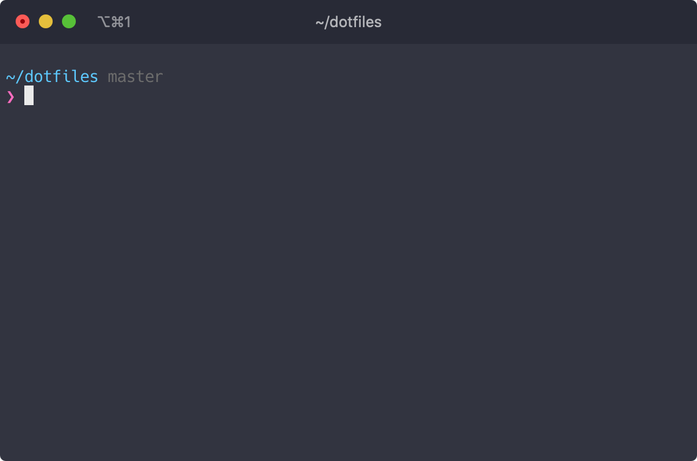

# ~dotfiles

## ⏰ Install steps in a new machine

### Install Fundamental Apps
1. Install **Chrome**, **1Password**, **Visual Studio Code**, **WebStorm** and **iTerm**.
1. Install **Logitech Options** `https://www.logitech.com/en-us/product/options`.
1. Install **Camera Settings** `https://support.logi.com/hc/en-us/articles/360049055854`.
1. Install **Aerial Screensaver** from `https://aerialscreensaver.github.io`.
1. Install **Purchased Apps** from **App Store**.
1. Install **Downloaded Apps** following `~/dotfiles/apps`.

### Configure Git
1. Install **Git** through Xcode Command Line Tools `xcode-select --install`
1. Add **SSH key** and add it to the agent `ssh-add -K ~/.ssh/id_rsa`.
1. Set **git name** `git config --global user.name "Guillermo Rodas"`.
1. Set **git email** `git config --global user.email <email>@gmail.com`.
1. Clone **dotfiles** repository `git@github.com:glrodasz/dotfiles.git`.

### Configure Brew
1. Install **brew** `/bin/bash -c "$(curl -fsSL https://raw.githubusercontent.com/Homebrew/install/HEAD/install.sh)"`.
1. Install **brew packages** from `~/dotfiles/brew`.

### Configure ZSH
1. Set **zsh shell** as default with `chsh -s /bin/zsh`.
1. Install **Oh My Zsh** `sh -c "$(curl -fsSL https://raw.githubusercontent.com/robbyrussell/oh-my-zsh/master/tools/install.sh)"`

### Configure Development Environment
1. Install **nvm** `curl -o- https://raw.githubusercontent.com/nvm-sh/nvm/v0.34.0/install.sh | bash`
1. Install **LTS** and **current** versions
1. Add aliases `prev` for LTS and `curr` for current version.
1. Install **npm packages** from `~/dotfiles/npm`

### Configure Terminal
1. Install **Pure** from `npm install --global pure-prompt`
1. Set **zsh**, **iTerm**, **terminal**, **vim** config from `~/dotfiles/zsh`, `~/dotfiles/iterm`, `~/dotfiles/terminal` and `~/dotfiles/vim`

### Configure Extra options
1. Configure **Macbook** options from `~/dotfiles/mac`

## ⏳ Backup for the future
1. Follow the instructions inside each folder
1. Backup the `.env` files `find ~/Code -name .env -not -path */node_modules/**` in a USB.
1. Backup the SSH Keys `./ssh` in a USB.
1. Commit lastest changes in `~/dotfiles` and push them.
